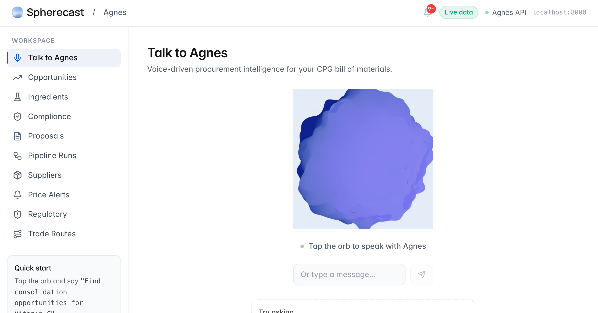

# Spherecast Agnes — Submission README

**Hackathon:** TUM.ai × Spherecast
**Repo:** https://github.com/timbtz/Spherecast-Agnes
**Team strategy doc:** `Agnes-Team-Playbook` (v3.2 condensed) — the source of truth for the bet we made and the yardstick we measured against.

This README is a reflective write-up of what we attempted, what we actually shipped, where we fell short, and what we would change given another run at it. The live documentation of the system itself (setup, endpoints, schema) lives in the repo's main `README.md` and `CLAUDE.md`; this document is the judging-pass companion.

---

## 1. General approach

**The bet.** Agnes is an AI sourcing co-pilot for CPG raw materials. The thesis we submitted on is that the hackathon rubric rewards *reasoning, evidence, hallucination control, and defensible proposals* — not feature count or UI polish. So the whole architecture is aimed at a single defensible chain: identity clustering + constraint-based substitution + dual-rule compliance + uncertainty propagation + a first-class refusal system. Every recommendation is either correctly approved, correctly refused, or explicitly escalated — never silently hallucinated.

**Strategy choice.** The playbook laid out two options: Strategy A (multi-agent, 140–180 eng-hours, stronger demo optics) and Strategy B (single reasoning agent + typed tools + background workers, 90–120 eng-hours, lower hallucination floor by construction). We shipped Strategy B and narrated Strategy A as the production roadmap via a v1→v5 promotion path. The rationale: at three engineers and a tight timeline, A's coordination overhead scales nonlinearly, and every cross-agent schema is time not spent on reasoning quality. B puts substitution, compliance, evidence, and refusal in one reasoning step while still leaving a clean path to split into agents when volume justifies it.

**Architecture we built to.** Four stages, each persistently grounded in SQLite so nothing is ever re-derived from a live page at reasoning time:

1. *Stage 1 — API exploration & schema lock.* PubChem, NIH DSLD, USDA FDC, openFDA, Molport, FDA IID. Every Agnes-written field carries `source` and `confidence`.
2. *Stage 2 — Enrichment pipeline.* Python phased runner that normalizes SKUs to a canonical ingredient, backfills SMILES/UNII/grade/role, scores consolidation opportunities, and seeds a substitution graph.
3. *Stage 3 — Agent orchestration.* FastAPI app loading YAML-defined pipelines into a DAG executor. Topological layers run in parallel via `asyncio.gather()`; every node execution is logged to `orchestration.db` and streamed over SSE.
4. *Stage 4 — React + ElevenLabs voice UI.* Vite/React frontend (Lovable-synced) served by FastAPI at `/`, with a DAG canvas, proposal/refusal views, regulatory-drift alerts, and a voice orb.

**Demo spine.** Magnesium stearate as a fully-worked anchor case — 12 SKUs, 6 brands, CAS 557-04-0, role inference per BOM, grade-morphology note, dual compliance across US-FDA + EU, supplier scoring, decision layer — with nine supporting simulations orbiting around it (fragmentation, compliance trap, supplier failure, price shock, priority reroute, coverage-gap closure). An 8-minute plan and a 5-minute Plan A′, rehearsed against the playbook's own rubric matrix.

**Design principles, non-negotiable.** Evidence everywhere (source + confidence on every field); idempotent always (re-running any phase or pipeline is safe); cache-first (all external API responses in SQLite); free-tier only (no Apify, no ChemAnalyst); auditable reasoning (every agent decision traceable to DAG steps in `orchestration.db`).

---

## 2. What worked

**The SQLite-as-reasoning-substrate bet paid off.** `db_enriched.sqlite` ended the sprint at 250 canonical ingredients, 854 SKU-to-canonical mappings, 515 BOM component quantities (58% of finished goods covered), 126 compliance rows across 9 cert types, 123 scored consolidation opportunities, 9,067 FDA IID rows (1,150 matched to canonicals by UNII), 32 substitution edges after a fuzzy-fallback pass, and 239/250 suppliers with commercial rows (95.6% coverage via curated backfill). Idempotent migrations let us re-run phases without fear, and every row carries its provenance.

**The orchestration layer overshot the plan.** We planned five pipelines; we shipped seven (`supplier_fallout`, `proactive_consolidation`, `new_ingredient_research`, `substitution_discovery`, `price_audit`, `price_monitor`, `regulatory_drift_alert`). We planned eight deterministic tools; we shipped thirteen, including three new ones that directly protect against bad outputs: `EntityVerifyTool` (GLEIF LEI lookup with a 30-day cache on a `Supplier_Master` table), `NoDataExplainerTool`, and `NoOpportunityExplainerTool` — the last two convert empty results into a first-class explanation instead of silent failure. The API surface ended at 17 endpoints with SSE streaming, a Gemini compound-intent router, and parallel fan-out to `secondary_runs[]` when a chat message implies more than one pipeline.

**Hallucination control held.** The 4-state `ComplianceReasonerTool` (pass-global / fork-recommended / human-review / refuse) replaced the old binary `compliance_gate` in `supplier_fallout` and `substitution_discovery`. Jurisdiction packs cover US-FDA, EU, CA, and JP. The refusal engine is wired with a confidence floor (0.50) and is a first-class UI output, not a hidden error state. The `RefusalEngine` / `Refusal_Log` / `Claim_Citation` trio persists both refusals and their supporting evidence; four demo trap refusals were seeded so the compliance-trap sim (#3) has something visible to catch. Proposal generation under Claude Haiku produced 14 proposals with 112 extracted citations before the sprint closed.

**The "active growth" rubric line landed.** Scout + curated + web-enrichment together closed coverage gaps the rubric specifically rewards. `supplier_web_enricher.py` calls the Gemini search sub-agent, parses JSON, and upserts into `Supplier_Commercial` with `Price_Source='google_search'`. That combined with the curated backfill took commercial coverage from 0 → 239/250. The regulatory-drift pipeline (`regulatory_drift_alert.yaml`) loads the FDA IID quarterly change log (187 rows, 27 matched) and the `price_monitor` pipeline is wired end-to-end to write into `Price_Change_Alert` when a delta crosses 15%.

**The UI did more than "be there".** The Lovable-synced React app is served by FastAPI out of `orchestration/ui/dist/`. DagGraphView shows humanized node class names and `when:` conditions, with output panels beneath the canvas (no clipping) and collapsible array fields. Dedicated views exist for Regulatory Alerts, Price Alerts, Compliance (with a Confirmed/Implied filter and derivation tooltip), Suppliers, Ingredients, Opportunities, Proposals, Trade Routes, and Pipeline Runs. The ElevenLabs voice orb + `useAgnesVoice` hook is wired to STT → `/chat` → SSE → TTS (Option 1 from the integration guide).

**The evidence ledger fell out of typed tool calls for free.** That was the core Strategy-B promise — that if every tool returns `{confidence, evidence_ids}` and writes its trace to `orchestration.db`, the ledger is emergent and doesn't need a separate merge step. It held up: `/runs/{id}` + `/runs/{id}/stream` give you the full reasoning trail per DAG node, live.

---

## 3. What did not work

**The full 6-gate qualification chain never reached the DAG.** The reasoning primitives all exist in `reasoning/` — `gate_engine.py`, `role_inferrer.py`, `compliance_reasoner.py`, `refusal_engine.py`, `supplier_scorer.py` — but the top-level `QualifyCandidateTool` that stitches them into a single per-pair decision is flagged CRITICAL-missing in `Orchestration/To-Do/missing-tools.md`. Pipelines currently run `compliance_reasoner_tool` in isolation, so the end-to-end "role → substitution → compliance → refusal → Q/C/L/R → RFQ" story is only fully present in the anchor case we narrate on stage, not in a live pipeline run.

**Logistics L-component is inspectable but not live.** `ComputeLaneCostTool` and `MapLogisticsTool` logic exists under `local-dev/` and the playbook names them as first-class rubric tools (for line 6, defensibility). They were never migrated into `orchestration/tools/`, which means supplier scoring runs without a real landed-cost input and the `Lane_Cost` table is empty.

**RFQs draft but don't dispatch.** `RfqFormatterTool` produces a structured RFQ with the implicit standard attached, but there is no `SendRfqTool` — the `Status='sent'` / `SentAt` transition and the `record_response()` handler for simulated replies are both absent. On stage we would have to narrate the closed loop rather than demonstrate it.

**The self-improving quality loop is half-open.** `RedTeamAgent` has 385 lines of complete implementation in `local-dev/reasoning/red_team.py` but isn't migrated or registered, so adversarial cases never populate `Case_Library` in `db_enriched.sqlite`. `ReEvalDaemon` has a full implementation under `local-dev/Orchestration/reeval_daemon.py` with eight trigger classes, but neither the async refactor nor the background-scheduling wiring (APScheduler vs event-triggered DAG node is still an open decision) landed. The `Critic / Calibrator` layer that consumes `Case_Library` to downgrade ambiguous high-confidence recommendations doesn't exist — it needs a PRD before any code.

**Some live loops are wired but never triggered.** The regulatory-drift pipeline is fully coded and the change-log data is loaded, but the pipeline has never been executed, so zero opportunities are flagged. `Price_Change_Alert` is empty because the price-monitor pipeline needs a first run to establish baselines and a second to detect deltas — we only ran it once. The `usePriceAlerts.ts` hook + TopBar badge are missing on the frontend, so even if alerts existed, the UI would not surface them.

**Gold-standard curation under-invested.** The playbook flagged this as *the* silent-derailment risk (Decision #2). We shipped with the substitution graph at 32 edges and 18 rules still unresolved after the fuzzy fallback; `Grade_Flag` has 11 unknowns among 250 canonicals; the gold-standard families (lubricants, fillers, emulsifiers, sweeteners) are narrow; and — crucially — the grade-morphology gate (PSD / surface area / bulk density) is not implemented, which means the magnesium-stearate anchor case emits its "PSD 50–200 μm inherited from incumbent, verify on first run" line as documentation, not as a gate output.

**Molport and IID enrichment are thinner than we pitched.** `MOLPORT_API_KEY` was never provisioned, so the live commercial stream is a no-op — our 95.6% supplier coverage is curated + web-derived, not live chemical-supplier pricing. FDA IID matching sits at 1,150/9,067 rows (12.7%) because synonym coverage on the ingredient side is weak, which is the same root cause of the 27/187 regulatory-drift match rate.

**Strategy B showed its seam at the reasoning-vs-orchestration boundary.** We over-indexed on orchestration-layer breadth (seven pipelines, thirteen tools, seventeen endpoints) at the expense of deepening the core reasoning gates. Several Strategy-A agents are narrated as v2–v5 promotions, but the tools they would promote from aren't yet standardized against the full agent-ready contract — for instance, not every tool writes events to a shared bus in the idempotent way v2 promotion assumes.

**Risk mitigations that didn't fully land.** R4 (LLM provider outage) was planned as a secondary provider swappable via env var; only one provider is wired in practice. R2 (pre-cache all 40 demo suppliers) is partially done — the fallback path exists, but the full cache hasn't been rehearsed offline.

---

## 4. How we would improve the submission

**Priority 1 — close the qualification chain.**
Migrate `QualifyCandidateTool` from `local-dev/` into `orchestration/tools/qualify_candidate_tool.py` and register it in `agent_registry.py`. Wire it into the three pipelines that need it (between `gate-compliance` and `format-rfqs` in `supplier_fallout`; between `scan-opportunities` and `write-proposals` in `proactive_consolidation`; after `gate-compliance` in `new_ingredient_research`). Persist outcomes to `Substitution_Gate_Result` and `Compliance_Outcome_4State` so the judge can click through any proposal to the six gates that produced it.

**Priority 2 — stand up the logistics column.**
Migrate `ComputeLaneCostTool` first (because `SupplierScorerTool` depends on it), then expose `SupplierScorerTool` as a registered DAG tool, then seed `Lane_Cost` via `MapLogisticsTool` on `data_update`. Once those three are live, supplier scoring stops being a formula in isolation and becomes an auditable `Q/C/L/R` breakdown with per-component evidence IDs.

**Priority 3 — dispatch the RFQs and close the loop.**
Add `SendRfqTool` with a stub email/API dispatch (flipping `Status='sent'`, stamping `SentAt`). Decide between pre-scripted supplier personas and LLM role-play for responses (the playbook calls this Decision #3 — pre-scripted is safer on stage, but one LLM-role-played response per pipeline gives the demo the closed-loop narrative without the variance surface).

**Priority 4 — wire the self-improving quality loop.**
Migrate `RedTeamAgent` into `orchestration/agents/`, wrap it in the async DAG-agent interface, register it, and create a `red_team_qa.yaml` pipeline triggerable on demand and on schedule. Migrate `ReEvalDaemon` as a one-shot async run (claim one row, process, return) driven either by APScheduler or by an event-triggered DAG node — this is the decision that blocks the migration and should be made first. Write the Calibrator PRD once both feeders are populating `Case_Library`.

**Priority 5 — make the loops we already wired actually loop.**
Trigger `regulatory_drift_alert` once end-to-end to populate alerts; harden the ingredient-synonym matcher so the 27/187 match rate climbs (and IID matching improves from 1,150/9,067 as a side effect). Run `price_monitor` twice in close succession to establish baselines and emit deltas. Add the `usePriceAlerts.ts` hook and TopBar alert badge so the UI surfaces what the backend now produces.

**Priority 6 — deepen gold-standard curation.**
This is the silent-derailment fix the playbook called out. Expand the must-not-merge hard-negative set to 30–50 pairs per family; resolve the 18 substitution rules still dangling after fuzzy fallback; classify the 11 `Grade_Flag` unknowns; implement the grade-morphology gate (PSD / surface area / bulk density) so the magnesium-stearate case emits a real gate output instead of a narrated one. Report per-family precision AND recall AND false-merge rate, and only ship families at ≥0.92 precision.

**Priority 7 — risk-proof the demo.**
Configure a secondary LLM provider and dry-run against it before the demo window (mitigates R4). Pre-cache all 40 demo suppliers and enforce the offline-only stress-injector toggle at the network layer (R2). Rehearse the 5-minute Plan A′ as if it were Plan A, not a fallback.

**Smaller wins that compound.**
Normalise every registered tool against the full agent-ready contract (confidence + evidence returned, events published to a shared bus even when unsubscribed, typed store access, context-carrying calls, idempotent) so the v1→v5 promotion path the playbook closes on becomes a rename rather than a rewrite. Wire the ElevenLabs Option-2 Conversational AI path so the voice layer can be demoed either as a direct pipeline trigger or as a conversational front-end. Swap the Molport stub for live fetch once the API key is provisioned so commercial-stream pricing stops being curated-plus-web and starts being primary-source.

---

## 5. Rubric coverage at submission

For reference — mapped from the playbook to where each criterion currently lands in the submission:

| Rubric criterion | Where it lands today | Gap |
|---|---|---|
| Practical usefulness | Identity clustering + anchor case + Sims #1 / #8 | None material |
| Reasoning + evidence trails | Typed-tool contracts, `orchestration.db` event log, SSE stream, per-recommendation confidence | Ledger UI scrolls events but doesn't yet render cross-run provenance |
| Hallucination control | 4-state compliance reasoner, refusal engine, `Refusal_Log`, 4 seeded trap refusals, entity verification via GLEIF | RedTeamAgent not live, so `Case_Library` empty |
| External-info sourcing | Enricher + Scout + web enricher + curated backfill; 239/250 supplier commercial rows | Scout is one-shot, not background; synonym matching weak |
| Substitution + compliance soundness | Constraint engine, 4-state rule, jurisdiction packs, hard-neg partial | Grade-morphology gate + QualifyCandidateTool missing |
| Defensibility of proposal | Q/C/R breakdown, compound confidence, Claim_Citation, NL justification | L component not live (ComputeLaneCostTool not migrated) |
| Scaling creativity | Active supplier-expansion loop (scout → commercial → substitution → opportunity) + v1→v5 evolution narrative | Self-improvement curve not measured against a stable baseline (Calibrator deferred) |

---

## 6. Key links

- Main developer README: `README.md`
- Live-state log (agent-maintained): `CLAUDE.md`
- Locked schema: `schema/enriched_schema.sql`
- Strategy source: `Agnes-Team-Playbook` (v3.2 condensed)
- Missing-tools catalogue: `Orchestration/To-Do/missing-tools.md`
- Missing-workers catalogue: `Orchestration/To-Do/missing-workers.md`
- YAML pipeline schema reference: `Orchestration/References/Tech/Orchestration/REF-YAML-PIPELINE-SCHEMA.md`
- ElevenLabs voice integration guide: `Orchestration/References/Tech/Orchestration/REF-ELEVENLABS-VOICE-PIPELINE-INTEGRATION.md`

---

*Submitted by the Agnes team, TUM.ai × Spherecast Hackathon.*
